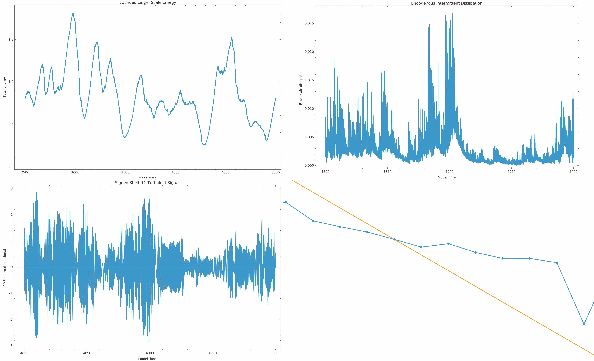
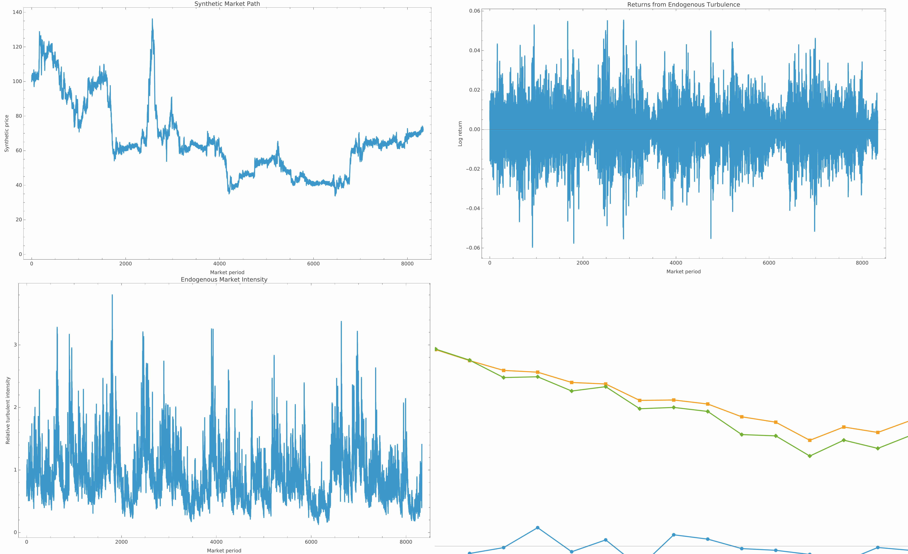
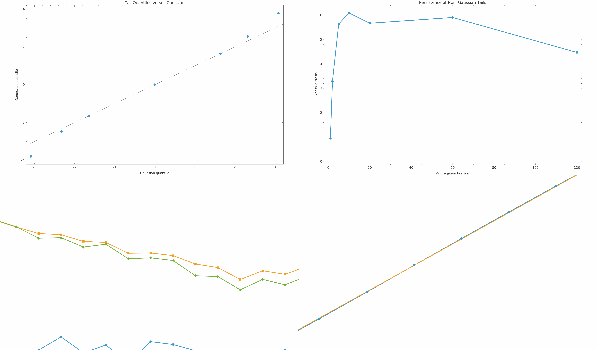

# Deterministic One-Dimensional Turbulence

This repository is an experimental Wolfram Language project for generating a seeded, reproducible, one-dimensional turbulent signal. Financial markets are the first observation domain, but the main research goal is broader:

> Can a small deterministic dynamical system generate intermittent, multiscale behavior without explicitly prescribing when extreme events occur, how large they are, or how long they persist?

The project began with a market generator that constructed a turbulent-looking volatility field from pseudorandom inputs. It then moved through a series of increasingly endogenous models and finished with a corrected Sabra shell-model cascade: randomness initializes the shell state, while the subsequent bursts, clustering, energy transfer, and dissipation come from deterministic nonlinear dynamics.



## Core idea

The early architecture was effectively:

```text
pseudorandom stream -> constructed volatility field -> returns -> prices
```

The final architecture is:

```text
seeded shell state
        -> deterministic nonlinear evolution
        -> interscale transfer and fine-scale dissipation
        -> signed one-dimensional turbulent signal
        -> deliberately simple domain adapter
```

The distinction matters. The final core has no event clock, peak indicator, peak-frequency parameter, severity distribution, or threshold-release rule. Those features were useful during development, but in the final model intermittent bursts are meant to emerge from the cascade itself.

## What was built

### 1. Original Rule 30 market prototype

The first generator uses a deterministic Rule 30 cellular automaton as a pseudorandom source, converts it to Gaussian variates, constructs persistent dyadic fields, and combines those fields into a log-volatility process. A market layer then generates scaled returns and a price path.

The preserved baseline run uses seed `20260817`, 8,192 observations, 10 levels, intermittency `0.38`, persistence `0.72`, and a target annualized volatility of `0.20`. Its export bundle includes the generated series, model definition, WXF state, plots, PDFs, metadata, statistical results, and SHA-256 hashes.

This prototype produced fat tails and volatility dependence, but it also revealed the conceptual limitation that motivated the rest of the project: the volatility process was constructed directly rather than generated by an autonomous turbulent mechanism.

### 2. Mechanical and statistical verification

The baseline verification notebook checks:

- required keys, dimensions, numeric values, and positive prices/volatility;
- price and log-price identities;
- deterministic regeneration from the saved seed and parameters;
- SHA-256 integrity of exported files;
- distribution moments and Jarque-Bera normality rejection;
- Gaussian-versus-generated tail quantiles;
- raw-, absolute-, and squared-return autocorrelation;
- temporal aggregation behavior;
- structure-function scaling exponents and their curvature.

This framework was retained and adapted as the model evolved.

### 3. Incremental turbulence mechanisms

`Working-Turbulence-Model.nb` rebuilds the model stage by stage so the effect of each mechanism can be inspected separately:

1. Gaussian baseline (`0.1`)
2. Independent peak frequency (`0.2`)
3. Distributed peak severity (`0.3`)
4. Persistent peak episodes (`0.4`)
5. Driven linear dissipative multiscale cascade (`0.5`)
6. Driven nonlinear state-dependent cascade (`0.6`)

This work also standardized the cascade interface around scale states, transfer fluxes, dissipation fluxes, cascade activity, and conditional scale. Variable and association-key inconsistencies between the linear and nonlinear stages were corrected.

The exported nonlinear run contains every stage comparison, the current price and return plots, the core and market associations, CSV/WXF data, metadata, hashes, and a full empirical-validation bundle. It verifies deterministic regeneration exactly and reports an internal activity-budget residual near machine precision (`8.88e-16`).

### 4. Endogenous reservoir experiments

`Emergence.nb` removes explicit peak events and tests whether peaks can arise from accumulation and release. It introduces:

- seeded Gaussian forcing and observation streams;
- bounded continuous coarse-scale forcing;
- coarse storage with hysteretic state-dependent release;
- four interacting reservoirs;
- nonlinear `E^(3/2)` transfer;
- downstream-capacity resistance;
- scale-dependent dissipation.

The result was scientifically useful but negative: fixed thresholds and one-way transfer produced synchronized relaxation oscillators. The reservoirs formed regular sawtooth cycles and repeated dissipation plateaus rather than genuinely irregular turbulent intermittency. Parameter tuning could obscure the periodicity but could not remove its structural cause.

Two timestamped export bundles preserve the reservoir states, nonlinear transfer fluxes, forcing-versus-dissipation comparison, combined PDF, and JSON manifest.

### 5. Corrected Sabra shell model

`Final-Experiment.nb` replaces the reservoir construction with a Sabra-type shell cascade. The final implementation is `GenerateSabraTurbulenceV2`, with:

- 16 complex shells;
- logarithmic shell spacing, `lambda = 2`;
- base wave number `1/16`;
- coefficients `{1, -0.5, -0.5}` satisfying `a + b + c = 0`;
- viscosity `10^-7`;
- constant complex forcing on the coarsest shell with amplitude `0.005`;
- seeded random phases and amplitude jitter only in the initial state;
- nonlinear triadic interaction among neighboring shells;
- viscous dissipation concentrated toward fine scales;
- integrated injection and dissipation ledgers.

The equations are solved with `NDSolveValue` using stiffness switching. The observable is the real component of a selected shell (shell 11 by default for 16 shells), RMS-normalized without forcing its sample mean to zero.

An earlier Sabra trajectory was found to use a stale right-hand-side definition. The algebraic nonlinear term conserved energy, but the stored trajectory had been generated by a mismatched equation. The model was therefore rebuilt with isolated `V2` definitions. Representative corrected checks in the notebook show:

- coefficient sum: `0`;
- initial nonlinear energy rate: `0`;
- maximum sampled nonlinear energy rate: about `1.38e-17`;
- signed-signal RMS after normalization: `1`;
- long-run relative energy-ledger residual: about `1.29e-7`.

The corrected long run displays bounded large-scale energy wandering, quiet intervals, clustered moderate activity, rare severe bursts, and irregular fine-scale dissipation without imposed peak timing or magnitude.

## Domain-neutral output and market adapter

`BuildGeneralTurbulence1D` samples the shell-model output into a generic interface containing:

- observation times;
- a signed one-dimensional turbulent signal;
- relative turbulent intensity;
- dissipation;
- construction and sampling metadata.

`SabraMarketAdapter` then converts this carrier into log returns and an accumulated price path. Its annualized volatility option is only a unit conversion. It does not introduce a second stochastic-volatility process, remove the sample mean, or add market noise.



## Canonical final experiment

The final saved run is constructed with:

```wl
sabraCoreFinal = GenerateSabraTurbulenceV2[
    20260817,
    "BurnInTime" -> 2500.,
    "SampleDuration" -> 2500.,
    "SampleInterval" -> 0.03,
    "MaximumStepSize" -> 0.01
];

generalTurbulence1DFinal = BuildGeneralTurbulence1D[
    sabraCoreFinal,
    "ObservationInterval" -> 0.30
];

sabraMarketResultFinal = SabraMarketAdapter[
    generalTurbulence1DFinal,
    "InitialPrice" -> 100.,
    "AnnualizedLogDrift" -> 0.,
    "AnnualizedVolatilityScale" -> 0.20,
    "PeriodsPerYear" -> 252.
];

sabraVerificationFinal = VerifyTurbulentMarketV2[
    sabraMarketResultFinal
];
```

The saved result contains 8,334 observations. Its displayed summary reports:

| Metric | Final saved run |
| --- | ---: |
| Annualized volatility | `0.19919` |
| Skewness | `0.00801` |
| Excess kurtosis | `0.95108` |
| Jarque-Bera p-value | `5.93e-69` |
| 0.1% generated / Gaussian quantile | `-3.792 / -3.090` |
| 99.9% generated / Gaussian quantile | `3.780 / 3.090` |
| Maximum absolute raw-return ACF, lags 1–20 | `0.06967` |
| Mean absolute-return ACF, lags 1–20 | `0.20589` |
| Mean squared-return ACF, lags 1–20 | `0.19634` |
| Scaling `zeta(0.5)` / `zeta(5)` | `0.23481 / 2.53827` |
| Quadratic scaling curvature | `-0.000811` |

The tails are visibly heavier than Gaussian and return magnitudes retain substantially more memory than signed returns. The scaling curvature in this particular final run is negative but small, so multifractality should be treated as a candidate property rather than a settled conclusion.



## Repository map

| Path | Purpose |
| --- | --- |
| `Untitled-1.nb` | Original Rule 30/dyadic-volatility market prototype and export workflow |
| `Verification.nb` | Mechanical integrity, reproducibility, distribution, dependence, aggregation, and scaling checks for the baseline |
| `Working-Turbulence-Model.nb` | Incremental Gaussian-to-nonlinear-cascade development (`0.1`–`0.6`) |
| `Emergence.nb` | Bounded forcing, storage/release, and interacting-reservoir experiments |
| `Final-Experiment.nb` | Sabra development, diagnostics, corrected `V2` core, generic 1D layer, market adapter, final verification, and README exports |
| `Baseline/exports/` | Reproducible artifacts from the original market prototype |
| `exports/nonlinear-cascade-*` | Stage plots, data, model state, validation results, and hashes from the driven nonlinear cascade |
| `exports/endogenous-reservoirs-*` | Reservoir plots, PDFs, and manifests |
| `readme-assets/` | Final core, market, and verification figures |

`Baseline/Base Build (Market turbulence) .nb` is an empty notebook shell in the current checkout; the corresponding baseline implementation is retained in `Untitled-1.nb` and in the exported `generator-definition.wl`.

## How to inspect or rerun it

The notebooks were created with Wolfram Mathematica 15.0 on Linux. No external Wolfram packages are referenced.

1. Open `Final-Experiment.nb` in Mathematica.
2. Evaluate the definitions in order, using the `V2` Sabra definitions rather than the superseded first implementation.
3. Run the canonical final block shown above. The integration covers 5,000 model-time units and can take appreciable time.
4. Evaluate the final README export section to regenerate `readme-assets/`.

For the historical stages, open the notebooks in the order shown in the repository map. The timestamped export folders can be inspected without rerunning Mathematica; JSON and CSV files contain the most portable summaries.

## Current status and limitations

Completed:

- deterministic baseline generator and reproducible export format;
- mechanical and empirical verification suite;
- incremental peak, memory, linear-cascade, and nonlinear-cascade experiments;
- endogenous storage/release and interacting-reservoir experiments;
- corrected Sabra `V2` core with energy accounting;
- domain-neutral one-dimensional observation layer;
- thin market adapter;
- canonical long run and README-ready graphics.

Remaining research work:

- repeat stationarity and empirical checks across longer windows and multiple seeds;
- test whether one fixed parameter regime preserves the results across seeds;
- quantify sensitivity to the observation shell and sampling interval;
- separate reusable definitions from saved notebook state into package/script files;
- resolve the legacy `ReplaceAll::reps` messages still emitted inside the final verification cell, even though corrected scaling values are subsequently recomputed and displayed;
- add a non-financial observation adapter to test whether the same core captures shared structure in another intermittent system.

This is a research prototype, not a calibrated financial model or a trading system. Its strongest claim is architectural: it now contains a reproducible, energy-accounted nonlinear cascade whose intermittent observable is generated by its dynamics rather than by an explicit market-event recipe.
